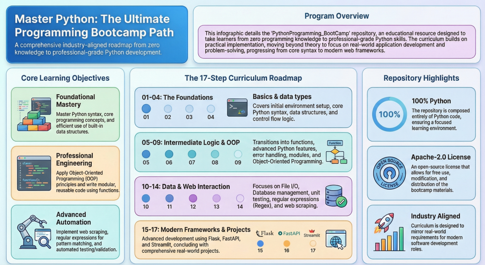

## **Python Programming Bootcamp**

A comprehensive, hands-on Python bootcamp designed to take learners from foundational concepts to advanced programming skills. This repository follows a structured, industry-aligned curriculum focused on practical implementation, problem-solving, and real-world application development.

---

## **About the Repository**

This repository contains structured learning materials, code examples, and practice modules covering core to advanced Python topics. The content is organized to support a progressive learning path with emphasis on clarity, depth, and practical exposure.

---

## **Learning Objectives**

By completing this bootcamp, learners will be able to:

```
1. Understand Python syntax and core programming concepts
2. Work efficiently with built-in data structures
3. Write modular and reusable code using functions
4. Apply object-oriented programming principles
5. Handle errors and debug applications effectively
6. Work with files, databases, and external libraries
7. Implement testing and validation techniques
8. Use regular expressions for pattern matching
9. Perform web scraping and automation tasks
10. Solve problems using algorithms and data structures
```

---



---

© 2026 Chandan Chaudhari. All Rights Reserved.